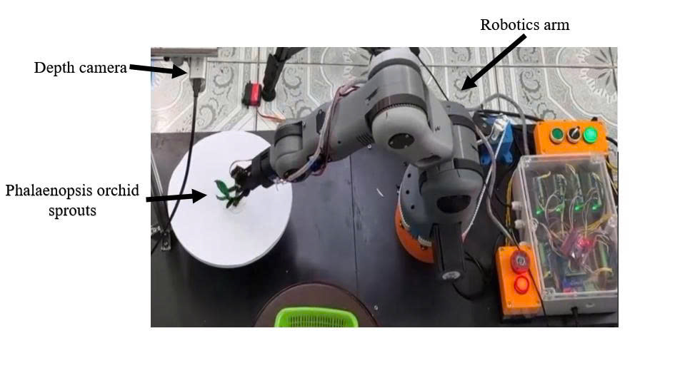
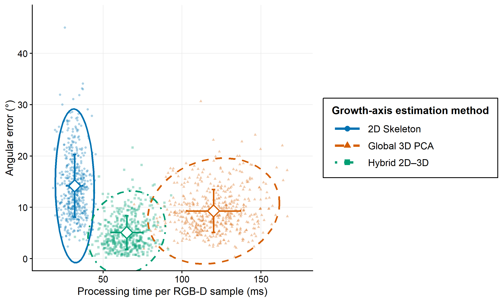

# Automated Orchid Propagation System

> **Graduation Thesis (DATN)** — A hybrid 2D–3D RGB-D method for estimating the
> growth axis of Phalaenopsis orchid buds and converting the estimated axis into
> a robot-referenced 6-DOF grasp pose, integrated with a custom 6-DOF robot arm.

---

## Demo

<p align="center">
  <br/>
  <em>System architecture — Embedded vision computer + 6-DOF robot arm with RGB-D sensing</em>
</p>

<p align="center">
  <br/>
  <em>Physical prototype — 6-DOF robot arm performing orchid shoot manipulation</em>
</p>

---

## Overview

This repository implements a hybrid 2D–3D RGB-D method for estimating the
growth axis of Phalaenopsis orchid buds and converting the estimated axis into
a robot-referenced 6-DOF grasp pose. The pipeline combines instance
segmentation, 2D skeleton guidance, depth-based point-cloud processing, and PCA
axis estimation.

This project combines a custom-built **6-DOF serial robot arm** with an **Intel RealSense D435i depth camera** and a **YOLOv8 instance segmentation model** to autonomously detect, locate, and manipulate orchid shoots (*mầm lan*) — replacing manual labor in orchid propagation.

### System Pipeline

```
RGB-D acquisition (RealSense D435i)
        │
        ▼
Instance segmentation (YOLOv8, v8_seg_1024.pt)
        │  detect & segment each orchid bud
        ▼
2D skeleton extraction
        │  tip detection, cutting point & angle
        ▼
Point-cloud reconstruction and filtering
        │  depth-based 3D extraction, outlier removal
        ▼
Skeleton-guided branch selection
        │
        ▼
PCA growth-axis estimation
        │
        ▼
Camera-to-robot transformation
        │
        ▼
6-DOF grasp pose → Arduino Mega 2560 (IK on-board)
        │  quintic trajectory interpolation
        ▼
6-DOF Stepper Robot → Cut / Grip / Branch
```

---

## Data and pretrained models

Representative image samples, trained model weights, and the raw numerical
evaluation data are available in the
[Google Drive folder](https://drive.google.com/drive/folders/1FqTuIMWtxHYL037exPB-O3m-0CBoGs5N?usp=drive_link).

The shared folder contains:

- `Images/`: representative JPEG images;
- `Model_train/weights/best.pt`: recommended segmentation weight for inference;
- `Model_train/weights/epoch360.pt` and `last.pt`: additional checkpoints;
- `Data_test/angularError_data.xlsx`: angular-error evaluation data;
- `Data_test/Time_data.xlsx`: processing-time evaluation data.

---

## Segmentation model

The instance-segmentation model was trained for 380 epochs using AdamW with a
learning rate of 0.001 and an input size of 1024 × 1024 pixels. The selected
model achieved a mask mAP@0.5 of 0.970 on the validation set.
The repository includes `Vision2D-3D/v8_seg_1024.pt`, which is the
`best.pt` checkpoint from the shared Google Drive folder renamed to match
the filename used by the application. The same checkpoint is also available
as `Model_train/weights/best.pt` in the shared Google Drive folder.

---

## Performance overview

The proposed hybrid method achieved the lowest mean angular error while
remaining substantially faster than the Global 3D PCA baseline.

| Method | Angular error (mean ± SD) | Processing time |
|---|---:|---:|
| 2D Skeleton | 14.2° ± 6.1° | 32 ms |
| Global 3D PCA | 9.3° ± 4.2° | 120 ms |
| Hybrid 2D–3D | 5.1° ± 3.3° | 65 ms |

Results correspond to 520 RGB-D samples from 250 specimens.



---

## Repository Structure

```
├── CAD/                        # SolidWorks 3D models (.SLDPRT, .SLDASM, .STEP)
│   ├── ROBOT_6DOF_ASSEM.SLDASM   # Full robot assembly
│   ├── ROBOT_6DOF_ASSEM.STEP     # Export for other CAD tools
│   ├── base.SLDPRT, J6.SLDPRT … # Individual part files
│   └── …
│
├── Code_robot_6DOF/
│   └── Code_robot_6DOF.ino     # Arduino Mega 2560 firmware
│
└── Vision2D-3D/
    ├── realsense_gui_advanced.py # Main vision GUI application
    ├── view_pointcloud.py        # Point cloud viewer utility
    ├── v8_seg_1024.pt            # Segmentation model used by the application
    ├── roi_config.txt            # Saved ROI configuration
    ├── Output_image/             # Exported result images
    └── Output_pointcloud/        # Generated automatically at runtime
```

---

## Hardware

| Component | Specification |
|---|---|
| Robot controller | Arduino Mega 2560 |
| Joints | 6× stepper motors (5× TB6600 and 1× TMC2208 drivers) |
| Depth camera | Intel RealSense D435i |
| End-effector | Pneumatic gripper (SMC MHZ2-16D) |
| Gripper control | Digital pin D3 (HIGH = close) |
| Task triggers | Digital pins D2, D14, D15 |

### Robot DH Parameters

| Parameter | Value |
|---|---|
| d1 | 231.5 mm |
| a2 | 221.68 mm |
| d3 | 224.75 mm |
| d6 | 202.64 mm |

### Steps Per Revolution (per joint)

| Joint | Steps/Rev |
|---|---|
| J1 | 27 333 |
| J2 | 18 000 |
| J3 | 18 000 |
| J4 | 6 400 |
| J5 | 12 000 |
| J6 | 8 192 |

---

## Software

### 1. Robot Firmware — `Code_robot_6DOF.ino`

- **Inverse Kinematics** computed entirely on-board (no ROS required)
  - Spherical wrist decomposition (analytical IK)
  - DH standard convention (ZYX RPY)
  - Singularity handling + joint limit enforcement
- **Quintic polynomial trajectory** interpolation for smooth motion
- **Coordinated multi-joint motion** — all joints arrive simultaneously
- **Command queue** — up to 100 waypoints (`G` / `GR` commands over Serial)
- **3 motion profiles:** `SMOOTH`, `BALANCED`, `FAST`
- **Speed multiplier** — runtime adjustable (10% – 300%)
- **Hardware task lists** — 3 pre-loadable programs triggered by D2/D14/D15
- **Arc motion** (`GR` command) with configurable steps

#### Serial Command Format

```
G x y z roll pitch yaw [delay] [j6_extra] [d3_state] [gripper_delay]
GR cx cy cz x y z roll pitch yaw [...]   # Arc motion around center
HOME                                      # Return to home position
SPEED <multiplier>                        # e.g. SPEED 1.5
PROFILE <0|1|2>                          # SMOOTH / BALANCED / FAST
STATUS                                    # Print current joint angles
```

---

### 2. Vision Application — `realsense_gui_advanced.py`

**Requirements:** Python 3.11, see [Dependencies](#dependencies)

The application uses the bundled `Vision2D-3D/v8_seg_1024.pt` checkpoint.
The same checkpoint is also available as `Model_train/weights/best.pt` in the
[shared Google Drive folder](https://drive.google.com/drive/folders/1FqTuIMWtxHYL037exPB-O3m-0CBoGs5N?usp=drive_link).

```bash
cd Vision2D-3D
python realsense_gui_advanced.py
```

#### Features

- **Real-time RGB + Depth preview** at 1280×720 @ 30 FPS (cropped to 720×720)
- **YOLOv8s Instance Segmentation** — runs every 5 frames for stability
- **Skeleton analysis** of each segmented shoot:
  - Tip detection (endpoints of skeleton branches)
  - Cutting point & cutting angle calculation
  - 2D (image-plane) or 3D (metric) base coordinate modes
- **3D Point Cloud export** (`.pcd` / `.ply`) with configurable quality
  - Outlier removal, smoothing, bilateral filter
  - Per-instance point cloud or combined
- **JSON tip export** — 3D coordinates + orientation for each instance
- **ROI (Region of Interest)** — draw, save, and auto-load detection area
- **Picking frame visualization** — coordinate axes at stem for robot planning

#### Output Files

| File | Description |
|---|---|
| `Output_pointcloud/*.ply` | Point cloud per instance |
| `Output_pointcloud/*_tips.json` | Tip positions (3D) + cut angle |
| `Output_image/*.png` | Annotated result images |

---

## Dependencies

### Python (Vision)

> **Note:** For CUDA-enabled PyTorch, install it separately using the
> [official PyTorch installation selector](https://pytorch.org/get-started/locally/)
> before running `pip install -r requirements.txt`.

```bash
pip install -r requirements.txt
```

| Package | Verified version |
|---|---|
| pyrealsense2 | 2.55.1.6486 |
| ultralytics (YOLOv8) | 8.3.59 |
| torch | 2.1.2+cu121 |
| torchvision | 0.16.2+cu121 |
| open3d | 0.19.0 |
| opencv-python | 4.10.0.84 |
| numpy | 1.26.4 |
| scipy | 1.13.1 |
| scikit-image | 0.24.0 |

### Arduino

- [AccelStepper](https://www.airspayce.com/mikem/arduino/AccelStepper/) library

---

## Reproducibility

Verified environment for reported results:

```
Python            3.11.9
ultralytics       8.3.59
torch             2.1.2+cu121
torchvision       0.16.2+cu121
opencv-python     4.10.0.84
open3d            0.19.0
numpy             1.26.4
scikit-image      0.24.0
pyrealsense2      2.55.1.6486
scipy             1.13.1
CUDA runtime      12.1
cuDNN             8801
GPU               NVIDIA GeForce RTX 3060
Training seed     0
PyTorch deterministic algorithms: False
```

---

## CAD Models

All mechanical parts are designed in **SolidWorks**. A STEP export (`ROBOT_6DOF_ASSEM.STEP`) is included for compatibility with other CAD tools (Fusion 360, FreeCAD, etc.).

Third-party component models included:
- `stepper 24BYJ-48` — Seeed Studio
- `28BYJ-48` stepper + ULN2003 driver board
- `NEMA17 42-40` stepper
- `Servo SG90`
- `SMC MHZ2-16D` pneumatic gripper
- `TB6600` stepper driver
- V-slot rail wheel (625-2Z bearing)

---

## License

This project is developed as a university graduation thesis. Third-party CAD models are subject to their original terms of use (see `CAD/readme-and-terms-of-use-3d-cad-models.txt`).
